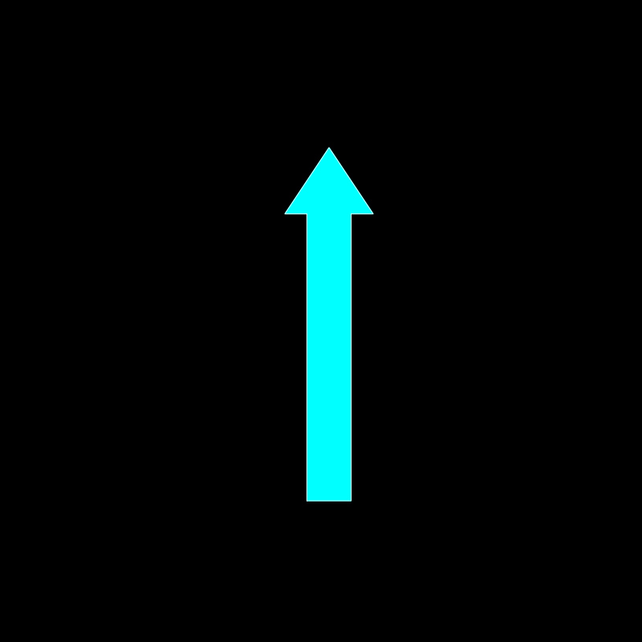
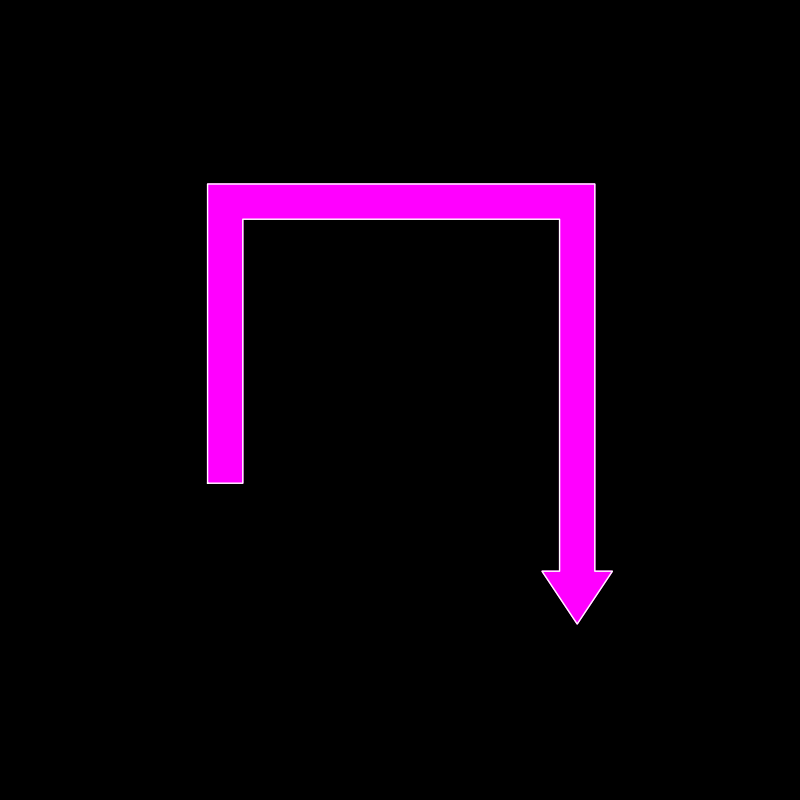
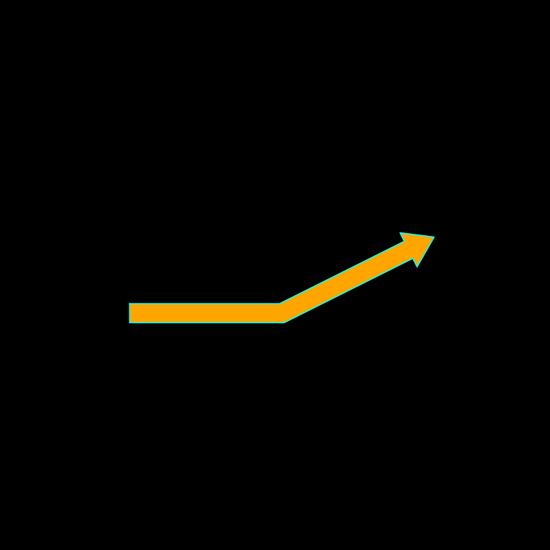
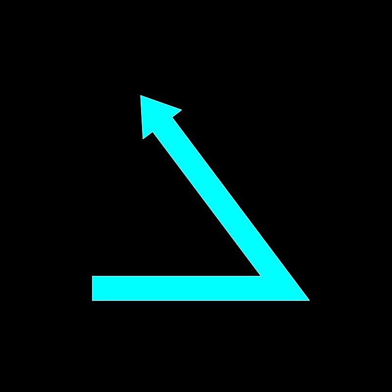
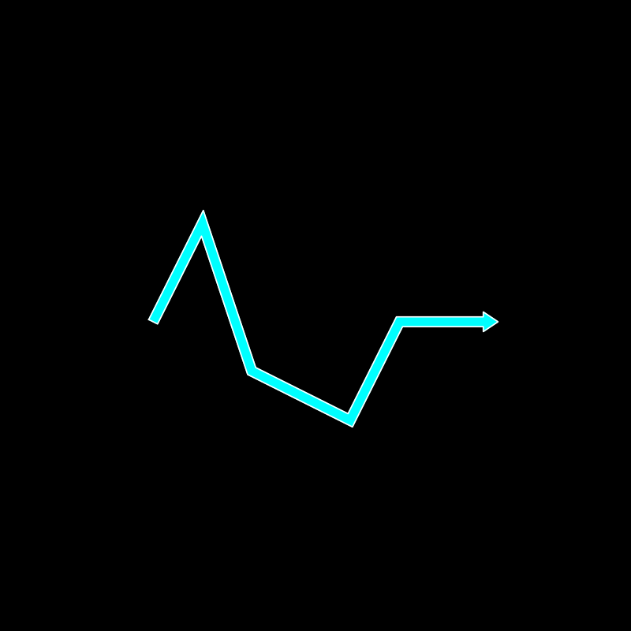
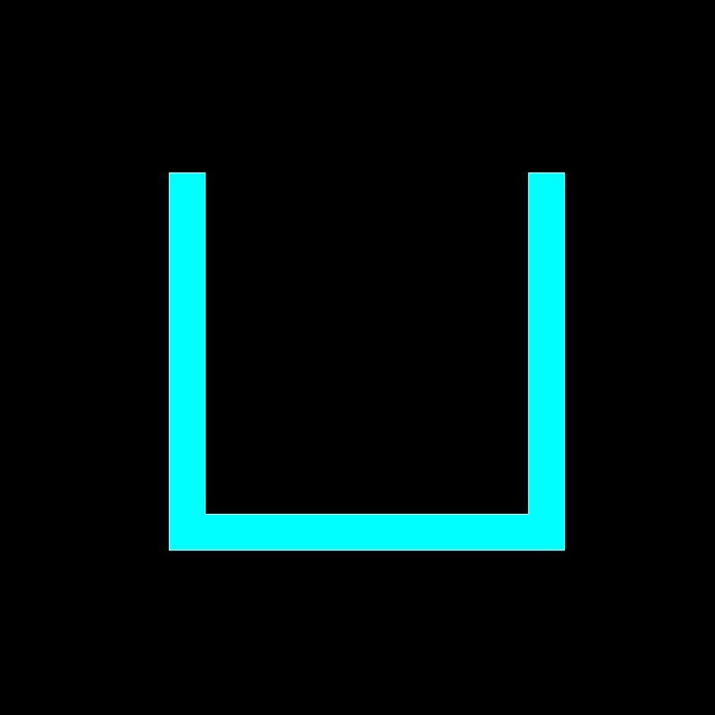
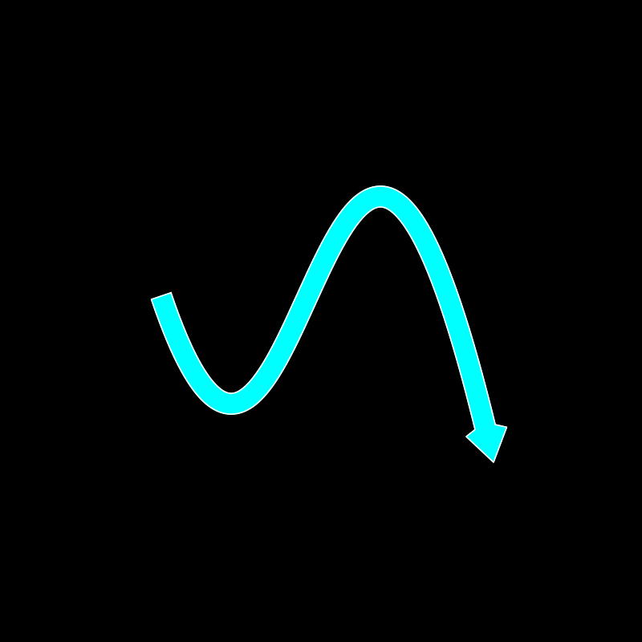
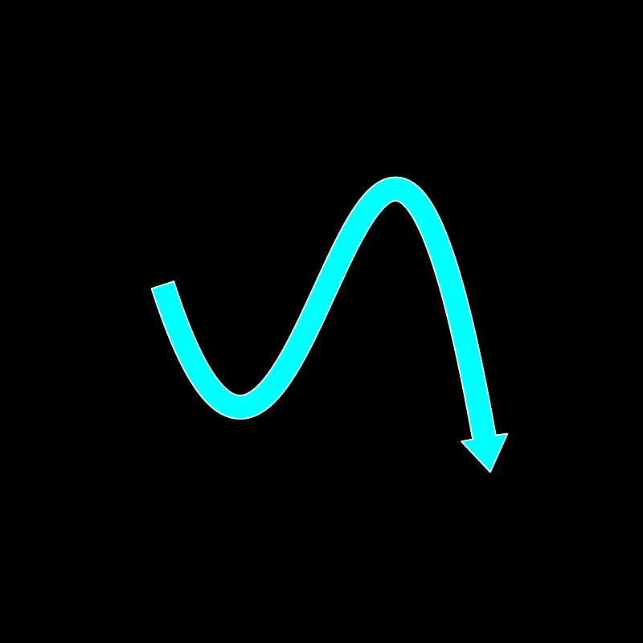

# ArrowETC

ArrowETC is a Python library for building flexible, multi-segmented arrows with explicit vertex control — perfect for precise, publication-quality diagrams. It was designed as a drop-in replacement for matplotlib’s `FancyArrow` and `FancyArrowPatch`, providing far greater control over arrow geometry, corners, and paths.

---

## Motivation

While `FancyArrow` and `FancyArrowPatch` in matplotlib offer basic arrow-drawing capabilities, they suffer from limited control: they don’t expose explicit vertex data, they lack support for multi-segment paths, and they provide no access to corner calculations for sharp mitered joints or smooth curves.

ArrowETC was created to overcome these limitations by giving full access to the arrow’s properties, allowing:
- Multi-segmented arrows with arbitrary bends.
- Accurate miter or curved joints.
- Optional smooth Bezier curves through control points.
- Easy addition of custom arrowheads with precise placement.
- Metadata about segment lengths and angles for advanced use.

This was essential for building [LogicTreeETC](https://github.com/yourusername/LogicTreeETC), a Python framework for generating logic and decision trees with annotated boxes connected by precise arrows representing information flow (e.g., suggested study paths or process flows).

---

## Features

- **Straight or curved arrows**: Draw arrows as straight lines or smooth Bezier curves through path points.
- **Multi-bend support**: Create arrows with multiple corners and arbitrary joint angles.
- **Precise arrowheads**: Add flared arrowheads with geometry matched to the arrow shaft.
- **Explicit geometry access**: Retrieve each polygon vertex for alignment, collision detection, or annotation.
- **Matplotlib-ready**: Output vertices directly usable in your matplotlib plots.

---

## Installation

ArrowETC requires Python 3.7+ and the packages `numpy`, `matplotlib`, and `scipy`. Install via pip:
```bash
pip install ArrowETC
```

---

## Examples

Below are practical examples showcasing what ArrowETC can do. These scripts generate images demonstrating straight, multi-segmented, and curved arrows with various configurations:


### Basic arrow with head

Draws a straight vertical arrow with an arrowhead at the tip. This demonstrates the simplest use of ArrowETC as a direct replacement for matplotlib’s FancyArrow.

```python
path = [(0, 0), (0, 4)]
arrow = ArrowETC(path, arrow_width=0.5, arrow_head=True)
arrow.save_arrow("_static/basic_arrow_with_head.png")
```



### Multi-segment arrow with head

Draws an arrow that bends twice — showcasing ArrowETC’s support for arbitrarily segmented arrows with mitered joints.

```python
path = [(0, 0), (0, 4), (5, 4), (5, -2)]
arrow = ArrowETC(path, arrow_width=0.5, arrow_head=True)
arrow.save_arrow(base_path / "multi_segment_arrow_with_head.png", fc="magenta", lw=1)
```



### Obtuse angle arrow

Illustrates how ArrowETC handles obtuse bends smoothly with obtuse corners.

```python
path = [(0, 0), (4, 0), (8, 2)]
arrow = ArrowETC(path, arrow_width=0.5, arrow_head=True)
arrow.save_arrow(base_path / "obtuse_arrow_with_head.png", fc="orange", ec="cyan", lw=1.2)
```



### Acute angle arrow

Shows an arrow with an acute angle, where the shaft sharply turns — highlighting ArrowETC’s ability to produce clean miters even for tight angles.

```python
path = [(0, 0), (4, 0), (1, 4)]
arrow = ArrowETC(path, arrow_width=0.5, arrow_head=True)
arrow.save_arrow(base_path / "acute_arrow_with_head.png")
```



### More complex multi-segmented arrow

Shows how the ArrowETC object can handle more complicated paths.

```python
path = [(0, 0), (1, 2), (2, -1), (4, -2), (5, 0), (7, 0)]
arrow = ArrowETC(path, arrow_head=True, arrow_width=0.2)
arrow.save_arrow(base_path / "many_segments_with_head.png", lw=1.2)
```



### Multi-segmented arrow without arrowhead

Creates a segmented rectangular “pipe” without an arrowhead, useful for process diagrams or connectors where a directional tip is unnecessary.

```python
path = [(0, 0), (0, -10), (10, -10), (10, 0)]
arrow = ArrowETC(path, arrow_width=1, arrow_head=False)
arrow.save_arrow(base_path / "multi_segment_no_head.png")
```



### Basic Bezier arrow with head

Uses a smooth Bezier curve instead of straight segments.

```python
path = [(0, 0), (4, 0), (8, 2)]
arrow = ArrowETC(path, arrow_width=0.5, arrow_head=True, bezier=True)
arrow.save_arrow(base_path / "basic_bezier_with_head.png", fc="orange", ec="cyan", lw=1.2)
```


### Complex Bezier arrows

- **Low bezier_n**: `bezier_n=400` — demonstrates how too few sample points can distort the arrowhead or tip on sharp, complex curves.

```python
path = [(0, 0), (4, -5), (8, 2), (16, -8)]
arrow = ArrowETC(path, arrow_width=1, arrow_head=True, bezier=True)
arrow.save_arrow(base_path / "crazier_bezier_with_head-low_n.png", lw=1.2)
```



- **High bezier_n**: `bezier_n=800` — shows a smooth, high-resolution arrow even along aggressive curves, fixing tip skew.

```python
path = [(0, 0), (4, -5), (8, 2), (14, -8)]
arrow = ArrowETC(path, arrow_width=1, arrow_head=True, bezier=True, bezier_n=800)
arrow.save_arrow(base_path / "crazier_bezier_with_head-high_n.png", lw=1.2)
```



These examples illustrate how ArrowETC can handle everything from straight connectors to advanced, smooth curved paths — making it an ideal replacement for matplotlib’s limited arrow types, and a powerful tool for your custom diagrams.

For reference, all example scripts are included in the `examples/` directory and the generated images are saved in the `resources/` directory on [GitHub](https://github.com/carret1268/ArrowETC)

## Why these examples matter

They demonstrate ArrowETC’s key advantages:
- Precise control of arrow geometry, including segment corners.
- Support for multi-segment and curved paths beyond what FancyArrow/FancyArrowPatch allow.
- Integration-ready arrow metadata for downstream tasks, e.g., logic trees using [LogicTreeETC](https://github.com/carret1268/LogicTreeETC).

## License

This project is licensed under a CC0 License. See LICENSE file for details.

## GitHub Link

[GitHub](https://github.com/yourusername/ArrowETC)

---

```{toctree}
:maxdepth: 2
:caption: Contents:

api
```